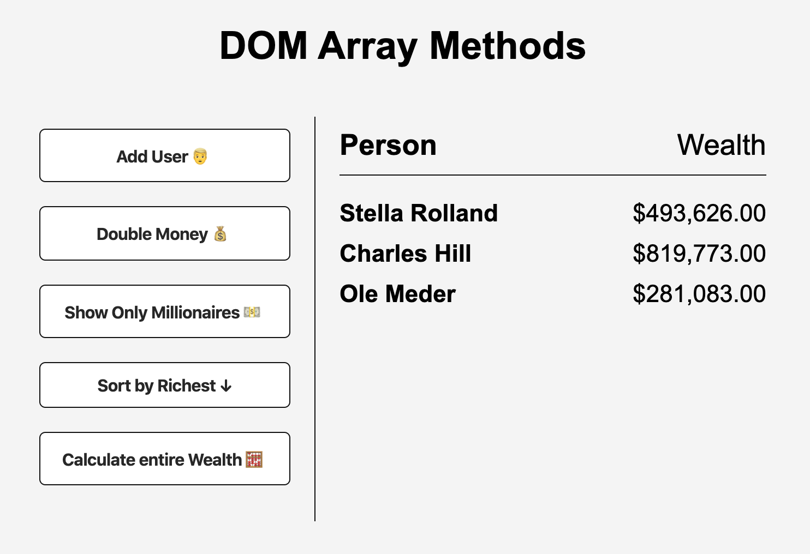
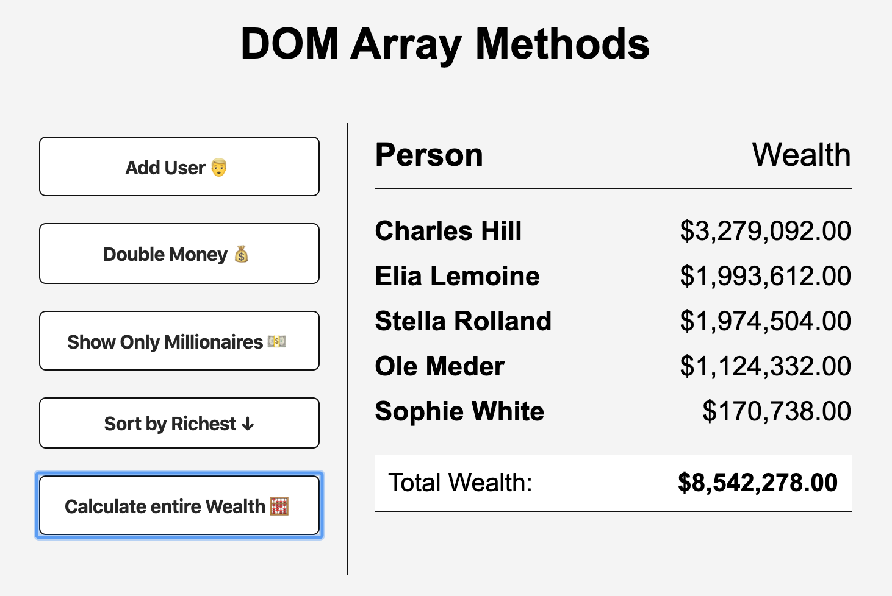

# DOM Array Methods

This project follows along with the [20 Web Projects With Vanilla JavaScript](https://www.udemy.com/course/web-projects-with-vanilla-javascript/) tutorials by Brad Traversy.

In this project, randomly generated names are paired with a random amount of wealth. Buttons on the left will modify information displaying on the DOM. To do this, the following array methods are practiced:

- forEach
- map
- filter
- sort
- reduce

This project uses JavaScript, HTML, and CSS. The user names are randomly generated via API.

